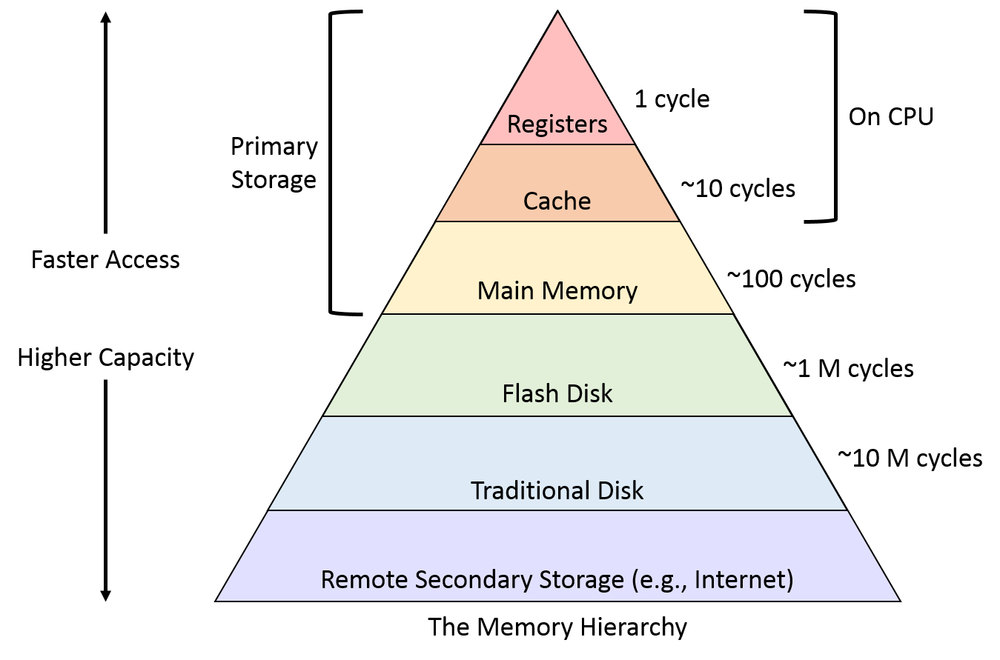

## Memory Hierarchy

## General-Purpose Registers

The 64-bit versions of the 'original' x86 registers are named:

* RAX – Stores function return values
* RCX – Counter for string and loop operations
* RDX – I/O pointer
* RBX – Base pointer to data section
* RSP – Stack (top) pointer
* RBP – Stack frame base pointer
* RSI – Source index pointer for data operations
* RDI – Destination index pointer for data operations

The registers added for 64-bit mode are named:

* R0 (alias for RAX)
* R1 (alias for RCX)
* R2 (alias for RDX)
* R3 (alias for RBX)
* R4 (alias for RSP)
* R5 (alias for RBP)
* R6 (alias for RSI)
* R7 (alias for RDI)
* R8
* R9
* R10
* R11
* R12
* R13
* R14
* R15

These may be accessed as:

- 64-bit registers using the 'r' prefix (original registers: `r_x`) or no suffix (added registers: `r__`): rax, r15
- 32-bit registers using the 'e' prefix (original registers: `e_x`) or 'd' suffix (added registers: `r__d`): eax, r15d
- 16-bit registers using no prefix (original registers: `_x`) or a 'w' suffix (added registers: `r__w`): ax, r15w
- 8-bit registers using 'h' ("high byte" of 16 bits) suffix (original registers – bits 8-15: `_h`): ah, bh
- 8-bit registers using 'l' ("low byte" of 16 bits) suffix (original registers – bits 0-7: `_l`) or 'b' suffix (added registers: `r__b`): al, bl, r15b

