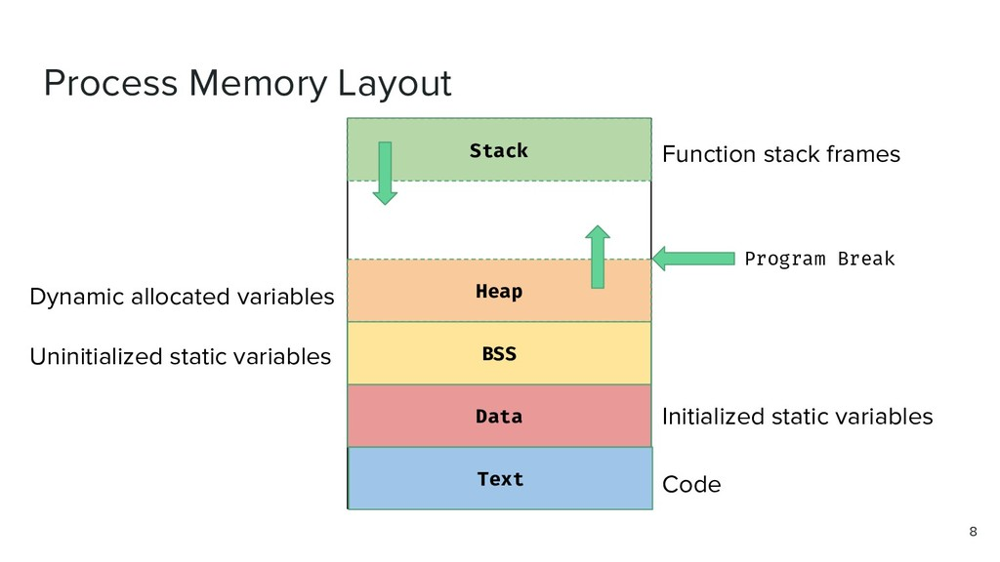

## Overview

* The stack is a conceptual area of main memory (RAM) which is designated by the OS when a program is started
  * Different OSes start it at different addresses by their own convention, or if they’re using ASLR (address space layout randomization)

* By convention the stack grows toward lower memory addresses. Adding something to the stack means the top of the stack is now at a lower memory addess

  

* RSP points to the top of the stack – *the lowest address which is being used*

  * While data *will* exist at addresses beyond the top of the stack, it’s considered *undefined*

* What can you find on the stack?
  * “Return addresses” so a called function can return back to the function that called it
  * Local variables
  * Function arguments (*sometimes*)
  * Register contents so functions can share registers without smashing the value for each other
  * Explicitly allocated memory via `alloca()`

## Push & Pop Instructions

* The push instruction automatically *decrements* the stack pointer by the size of the operand and places the value onto the stack
* The pop instruction restores the top of the stack into the operand and automatically *increments* the stack pointer by the size of the operand
* In 64-bit execution mode, operand can be:
  * The value in a 64-bit register
  * A 64-bit value from memory, as given in “r/mX” form

### “r/mX” Addressing Forms

* “r/mX” refers to “r/m8”, “r/m16”, “r/m32” or “r/m64” in the Intel manual
* In Intel syntax, most of the time square brackets `[]` mean to treat the value within as a memory address and fetch a value at that address (like dereferencing a pointer)
* An “r/mX” can take 4 forms:
  * Register → `rbx`
  * Memory, base-only → `[rbx]`
  * Memory, base + index * scale → `[rbx+rcx*X]`, for X = 1, 2, 4 or 8
  * Memory, base + index * scale + displacement → `[rbx+rcx*X+Y]`, for Y of 1 byte (0, 2^8) or 4 bytes (0, 2^32)
    * Has a natural applicability to multi-dimensional array indexing, array of structs, etc.

### Backtick address convention

* When writing 64-bit numbers, it can be easy to lose track of whether you have the right number of digits
* WinDbg allows you to write 64-bit numbers with a backtick between two 32-bit halves: 0x12345678`12345678
* Probably, WinDbg is the only tool that supports entering 64-bit numbers like that

