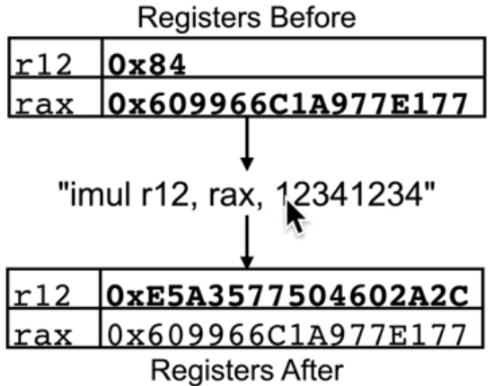

## Adding a single local variable

> Variables are stored on the stack

### Mystery 1: Why is MSVC over-allocating space for a single local variable?

> Because modern C/C++ compilers favor a 16-byte stack alignment so they can generate optimal SIMD code, using SSE2 or AVX.

So, 0x18 comes from:

* 0x8-sized alignment padding for a return address (which is 0x8-sized), produced by CALL instruction in main()
* 0x10-sized chunk, allocated for a local variable itself (1 chunk can contain up to 2 qword-sized variables)

## Adding and accessing an array local variable

### IMUL – Signed Multiply

* FYI, MSVC seems to have a predilection for imul over mul (unsigned multiply). You’ll see it showing up in places you expect mul

* Has three forms. One, two and three operands:

  **Single Operand:**

  * `imul r/m8`: AX = AL * r/m8
  * `imul r/m16`: DX:AX = AX * r/m16
    * Most-significant 16 bits are stored in DX
    * Least-significant 16 bits are stored in AX
  * `imul r/m32`: EDX:EAX = EAX * r/m32
    * Most-significant 32 bits are stored in EDX
    * Least-significant 32 bits are stored in EAX

  * `imul r/m64`: RDX:RAX = RAX * r/m64
    * Most-significant 64 bits are stored in RDX
    * Least-significant 64 bits are stored in RAX

  **Two Operand:**

  * `imul r16, r/m16`: r16 = r16 * r/m16
  * `imul r32, r/m32`: r32 = r32 * r/m32
  * `imul r64, r/m64`, r64 = r64 * r/m64
    * *TRUNCATION WARNING!*

  **Three Operands, 8-bit Immediate**:

  * `imul r16, r/m16, imm8`: r16 = r/m16 * sign-extended imm8
  * `imul r32, r/m32, imm8`: r32 = r/m32 * sign-extended imm8
  * `imul r64, r/m64, imm8`: r64 = r/m64 * sign-extended imm8
    * *TRUNCATION WARNING!*

  **Three Operands, 16-bit Immediate**:

  * `imul r16, r/m16, imm16`: r16 = r/m16 * imm16
    * *TRUNCATION WARNING!*

  **Three Operands, 32-bit Immediate**:

  * `imul r32, r/m32, imm32`: r32 = r/m32 * imm32
  * `imul r64, r/m64, imm32`: r64 = r/m64 * sign-extended imm32
    * *TRUNCATION WARNING!*

* Possibly the only “basic” instruction with **three** operands

### IMUL Example 1

> IMUL r/m8

* Because IMUL performs a **signed** multiplication, 0x84 in r12b is considered **negative**: 0x84 is greater than 0x80, which is the upper limit for a `signed byte`, so the distance (0x84 - 0x80) is being subtracted from the upper limit. Thus: 0x80 - (0x84 - 0x80) = **0x7c**.
* 0x77 is less than 0x80, so it’s considered **positive** and left as is.
* 0x7c * 0x77 = **0x39a4**. No truncation occurs in single operand form.
* Negative number times positive number equals **negative** number, so we need to recover its “true” form to write it into a register. To do so, we’d have to do the inverse of what we did in 0x84’s case: 0x8000 + (0x8000 - 0x39a4) = **0xc65c**, where 0x8000 is the upper limit for a `signed short`.

### IMUL Example 2

> IMUL r32, r/m32

* 0x84 in r12d is considered **positive** and left as is – the upper limit for a `signed int` is 0x80000000 and 0x84 is less than 0x80000000.
* 0xA977E177 in eax is considered **negative** – 0xA977E177 is greater than 0x80000000, so the distance (0xA977E177 - 0x80000000) is being subtracted from the upper limit. Thus: 0x80000000 - (0xA977E177 - 0x80000000) = **0x56881e89**.
* 0x56881e89 * 0x84 = 0x2c9e2fbea4. Remember about truncation in two operand form? That’s why we’ll only be left with **0x9e2fbea4** – 0x2c9e2fbea4 won’t fit in 4 bytes.
* Negative number times positive number equals **negative** number, so we need to recover its “true” form to write it into a register. To do so, we’d have to do the inverse of what we did in 0xA977E177’s case: 0x80000000 + (0x80000000 - 0x9e2fbea4) = **0x61d0415c**.

### IMUL Example 3

> IMUL r64, r/m64, imm32

* 0x609966c1a977e177 in rax is considered **positive** and left as is – the upper limit for a `signed long` is 0x8000000000000000 and 0x609966c1a977e177 is less than 0x8000000000000000.
* 0x0000000012341234 (sign-extended) in immediate is considered **positive** and left as is for the same reason. 
* 0x609966c1a977e177 * 0x12341234 = 0x6de6f40e5a3577504602a2c. Remember about truncation in three operand form? That’s why we’ll only be left with **0xe5a3577504602a2c** – 0x6de6f40e5a3577504602a2c won’t fit in 8 bytes.
* Positive number times positive number equals **positive** number, so no post-processing is required. 

## MOVZX – Move with zero extend + MOVSX – Move with sign extend

* Used to move small values (from smaller types) into larger registers (holding larger types)
* Support same forms as normal MOV
* “Zero extend” means the CPU unconditionally fills the high order bits of the larger register with zeros
* “Sign extend” means the CPU fills the high order bits of the larger register with whatever the sign bit is set to on the small value

### MOVSXD – Move with sign extend (DWORD)

* MOVSX technically only sign extends from 8 or 16-bit values
* If you want to sign extend a 32-bit value to 64 bits, you need to use MOVSXD
  * There is no “MOVZXD”, it’s always just MOVZX

## Array local variable takeaways

* Local variables doesn’t need to be stored on the stack in the same order they are defined in the high level language
* Array access is typically done by multiplying the size of the array element (4 bytes in int’s case), times the index to be accessed (1 and 4 in this case)
* Array variable of length at least 16 bytes or a C99 variable-length array variable always has an alignment of 16 bytes (`movzx eax, word ptr [rsp+rax+10h]`)

## Struct local variable

### Takeaways

* Fields in a struct must be stored in the same order they were declared in the high level language. They will appear on the stack with the uppermost field at the lowest address and all subsequent fields on higher addresses
