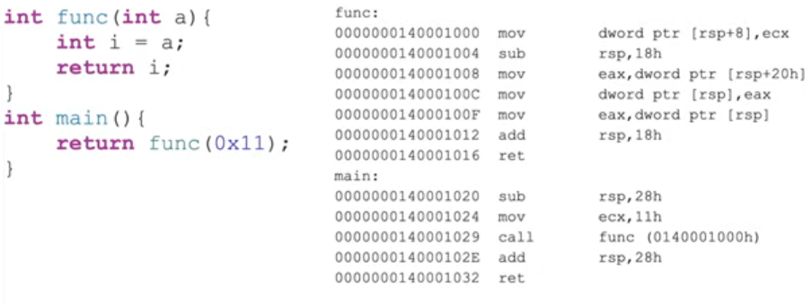
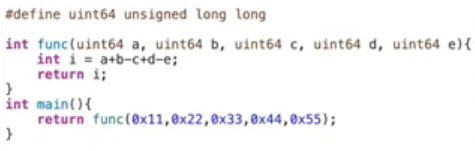
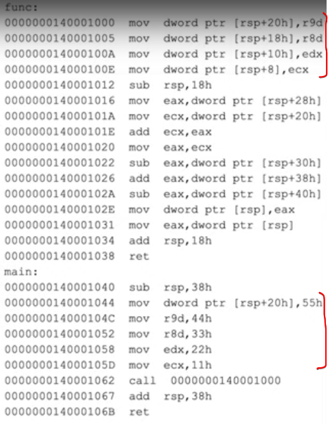
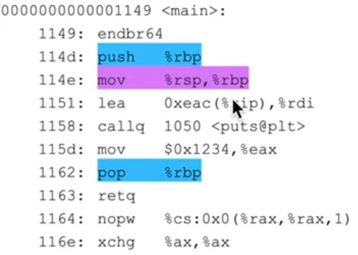

## Passing a single argument

### Mystery 1: Why the value which is being passed in a register is then still being stored on the stack?

> The x64 Application Binary Interface (ABI) uses a four-register fast-call calling convention by default. Space is allocated on the call stack as a shadow store for callees to save those registers.
> <…>
> The caller is responsible for allocating space for the callee's parameters. The caller must always allocate sufficient space to store four register parameters, even if the callee doesn't take that many parameters.
> <…>
> Any parameters beyond the first four must be stored on the stack after the shadow store before the call. 

So, that `sub rsp, 38h` in main() comes from:

* 0x8-sized alignment padding for a return address (which is 0x8-sized) to whoever called main()
* 0x20-sized chunk – Microsoft x64 ABI shadow space
* 0x10-sized allocation for a fifth argument in a func() call

## Calling Conventions

* 2 elements of importance:
  * *Register* conventions for which registers “belong” to the caller or the callee
  * *Parameter-passing* conventions for which registers are used for argument transfer
* Both are compiler-dependent

### x64 Register Conventions: Caller-save registers

* Also called “volatile” registers by MS
  * I.e. the caller should assume they **will** be changed by the callee
* Registers “belong” to the callee => the caller is responsible for saving the value before the call to a subroutine and restoring the value after the call returns
* **MSVC**: RAX, RCX, RDX, R8, R9, R10, R11

* **GCC**: RAX, <ins>RDI, RSI</ins>, RDX, RCX, R8, R9, R10, R11

### x64 Register Conventions: Callee-save registers

* Also called “non-volatile” registers by MS
  * I.e. the caller should assume they **will not** be changed by the callee
* Registers “belong” to the caller => if the callee needs to use more registers than are saved by the caller, the callee is responsible for making sure the original values are restored after use
* **MSVC**: RBX, RBP, <ins>RDI, RSI</ins>, R12, R13, R14, R15

* **GCC**: RBX, RBP, R12, R13, R14, R15

### Register Conventions: Balance

* Both caller and callee are responsible for *balancing* any register saves they perform (stack pushes/allocations) with restores (stack pops/deallocations)
* Caller will typically save registers <ins>right before the call</ins> and restore <ins>right after the call</ins>
* Callee will typically save registers <ins>at the function prologue</ins> and restore <ins>at the function epilogue</ins>

### Parameter-passing Conventions: Common

* x86-64 compilers use a subset of the *caller-save* registers to pass parameters into and out of functions
* RAX or RDX:RAX passes out the return value
  * RAX holds anything 64 bits or smaller
  * RDX:RAX can be used to return 128-bit values

### Parameter-passing Conventions: Microsoft x64 ABI

* First 4 parameters (left-to-right) are put into RCX, RDX, R8, R9 respectively

* Remaining parameters are “pushed” onto the stack so that the left-most parameter is at the lowest address

  * Typically “mov” is used instead of “push” though (to maintain stack alignment)

* Generally doesn’t use frame pointers for most of the code except for when `_alloca` is used:

  * > If space is dynamically allocated (`_alloca`) in a function, then a non-volatile register must be used as a frame pointer to mark the base of the fixed part of the stack and that register must be saved and initialized in the prolog.

### Parameter-passing Conventions: System V x86-64 ABI

* First 6 parameters (left-to-right) are put into RDI, RSI, RDX, RCX, R8, R9 respectively
* Remaining parameters are pushed onto the stack from right to left (the left-most parameter ends up at the lowest address)
  * Typically “mov” is used instead of “push” though (to maintain stack alignment)
* Uses frame pointers in 32-bit style, unless directed otherwise by compiler options:

### x86 Stack Calling Conventions

* In 32-bit code, there are more calling conventions in use:
  * “__cdecl” (default for most C code) – Caller cleans up the stack
  * “__stdcall” (for Win32 APIs) – Callee cleans up the stack
* Function parameters are pushed onto the stack from right to left (the left-most parameter ends up at the lowest address)

## LEA – Load Effective Address

* Uses the “mX” form (not “r/mX”), but **doesn’t dereference** the address in the square brackets!
* Example: rbx = 0x2, rdx = 0x1000
  * `lea rax, [rdx + rbx * 8 + 5]` will yield 0x1015 at rax, but not the value at 0x1015
* When a compiler sees “special math” that can be computed in form of “a + b * X + Y”, then it can compute the result faster if it uses the LEA instruction, rather than IMUL for instance

