## Privilege Rings

* MULTICS was the first OS with support for hardware-enforced privilege rings

* Intel's rings are also enforced by hardware

* You often hear that normal programs execute in "ring 3" (userspace/usermode) and the privileged code executes in "ring 0" (kernelspace/kernelmode)

* The lower the ring number, the more privileged the code is

* In order to find the rings, we need to understand a capability called segmentation

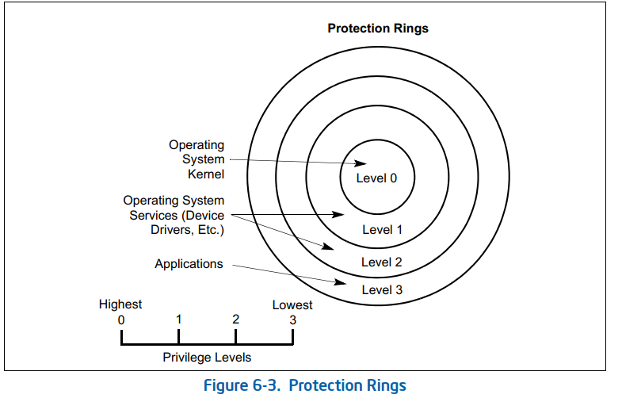

## Segmentation

* "Segmentation provides a mechanism for dividing the processor's addressable memory space (called the **linear address space**) into smaller protected address spaces called **segments**."

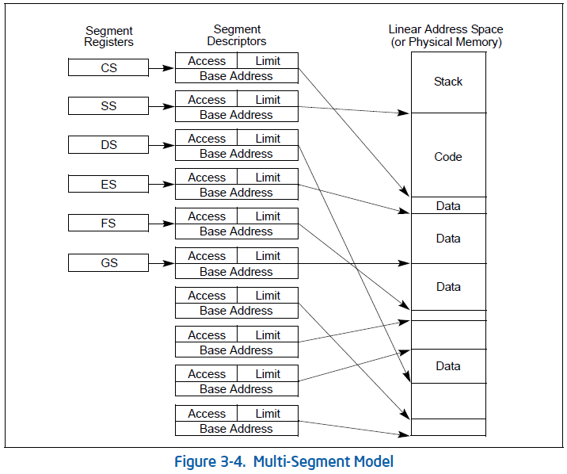

### Segment Addressing

* "There is no mode bit to disable segmentation."

* "To locate a byte in a particular segment, a **logical address** (also called a far pointer) must be provided. A logical address consists of a segment selector and an offset."

* Segmentation translates logical addresses to linear addresses by using table lookups

* These linear addresses are then mapped to physical addresses using processor's paging mechanism

* If paging is disabled, Linear addresses == Physical addresses

* "The physical address space is defined as the range of addresses that the processor can generate on its address bus."

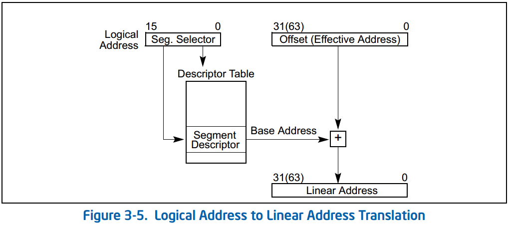

### Segment Selectors

* A **segment selector** is a 16-bit data structure. It is used to select different data structures from one of two tables:
  
  * GDT – Global Descriptor Table
  
  * LDT – Local Descriptor Table

* Note that the table index is actually 13 bits, not 16, so the tables can each hold a maximum of 2^13 = 8192 data structures

### The Six Segment Registers

* CS – Code Segment

* SS – Stack Segment

* DS – Data Segment

* ES/FS/GS – Extra (usually data) segments

* They are all 16-bit and support MOV/PUSH/POP just like general-purpose registers

### Windows Lab Notes

* Windows x86-64 maintains different CS, SS segment selectors for userspace processes vs kernel ones

* Windows x86 maintains different CS, SS **and FS** segment selectors for userspace vs kernel ones

* Windows x86-64 doesn't change DS, ES, FS or GS segment selectors when moving between userspace and kernelspace

* Windows x86 doesn't change DS or ES segment selectors when moving between userspace and kernelspace

* Windows x86 doesn't use GS

* The RPL field of CS and SS segment selectors seems to correlate with the ring number for kernelspace or userspace

## GDT & LDT

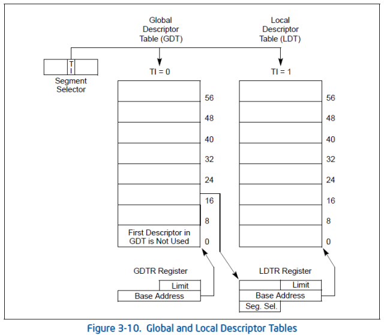

### Global Descriptor Table Register (GDTR)

* The upper 64 bits ("base address") of the register specifies the linear address where the GDT is stored

* The lower 16 bits ("table limit") specifies the size of the table in bytes

* Special instructions are used to load a value into the register or export it to the memory:
  
  * LGDT – Load 10 bytes from memory into GDTR
  
  * SGDT – Store 10 bytes of GDTR into memory

### Local Descriptor Table Register (LDTR)

* Special instructions are used to load a value into the register or export it to the memory:
  
  * LLDT – Load 16-bit segment selector from memory into LDTR
  
  * SLDT – Store 16-bit segment selector of LDTR into memory

## Segment Descriptors

* Each entry in the GDT and LDT is a data structure called a Segment Descriptor

* "Each segment has a segment descriptor, which specifies the size of the segment, the access rights and privilege level for the segment, the segment type, and the location of the first byte of the segment in the linear address space"
  
  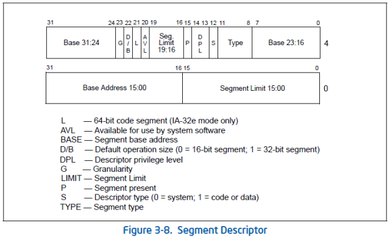

### Long Mode Flag

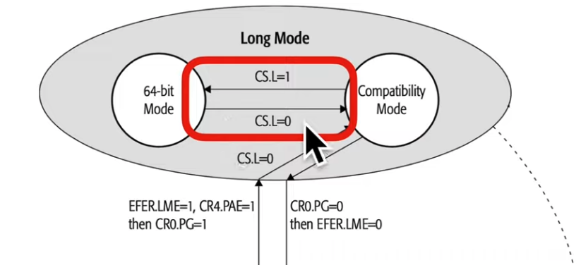

> If Code Segment's L Flag is set, then program operates in 64-bit mode. Otherwise, it's in Compatibility Mode

### Segment Base

* Base (32 bits): linear address where the segment starts, for Compatibility Mode

* For 64-bit mode, the base is just always treated as 0 for CS, SS, DS and ES

* For FS and GS, the hidden part of segment registers is mapped into the IA32_FS_BASE (0xc0000100) and IA32_GS_BASE (0xc0000101) MSRs respectively. So, a full 64-bit address can be written there instead of the segment descriptor
  
  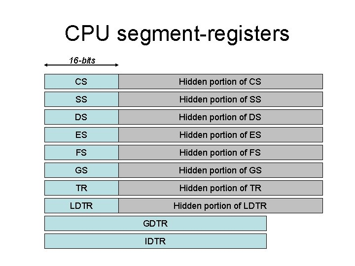

### Segment Limit

* Limit (20 bits): size of the segment (in bytes or 4kb blocks), for Compatibility Mode

* Limits are not actually checked anymore in 64-bit mode, even for FS and GS

### Granularity Flag

* G Flag: whether the Limit is specified in bytes or 4kb blocks, for Compatibility Mode

* Not used in 64-bit mode

### Present Flag

* P Flag: "If this flag is clear, the processor generates a segment-not-present exception (#NP) when a segment selector that points to the segment descriptor is loaded into a segment register."

### System Flag

* S Flag: 0 for System Segment, 1 for Code or Data Segment

### Type Flags

* Type (4 bits): Different types for System and non-System descriptors

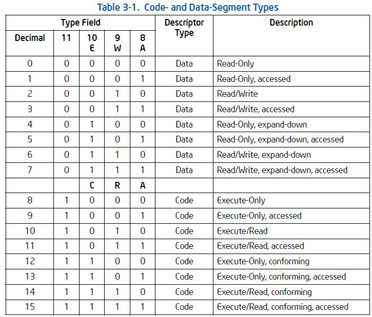

#### What's the Point of Expand-Down?

* Originally for Stack Segments, to allow for growth towards lower addresses

* Although a read-only && expand-down segment can't be used for stack segments

* "Loading the SS register with a segment selector for a non-writable data segment generates a general-protection exception (#GP)"

#### What's the Point of Conforming/non-Conforming?

* Conforming segments allow lower privilege code to execute them
  
  * Ring 3 code could just jump into Ring 0 conforming segments and keep running!

* Non-conforming segments behave how you'd expect them to from a security perspective, and will throw a general-protection exception if someone from a lower privilege level tries to execute them

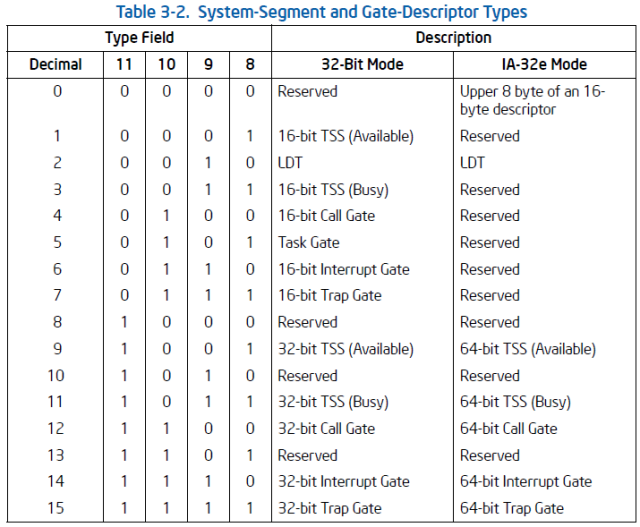

> System descriptors in IA-32e mode are 16 bytes instead of 8 bytes

### System Flag + Type Flag

* Windows combines the S and Type fields in its KGDTENTRY64 struct to treat it like a 5-bit field of 32 types instead of two 4-bit fields of 16 types

### D/B Flag

* D/B Flag: Used for completely different stuff based on the descriptor type

* Code Segment:
  
  * "D" (Default Opcode Size) flag
  
  * This is what actually controls whether an overloaded opcode is interpreted as dealing with 16 or 32 bit register/memory sizes
    
    * The processor fetched a 0x25 (AND) in the instruction stream. How would it know whether it should be followed by 2 bytes (imm16) or 4 bytes (imm32)?
    
    * If the D flag is clear, it's 2 bytes. Otherwise, it's 4 bytes
    
    * "The instruction prefix 66H can be used to select an operand size other than the default": `89 d8` == `mov eax, ebx`; `66 89 d8` == `mov ax, bx`

* Stack Segment:
  
  * "B" (Big) flag
  
  * Whether implicit stack pointer usage (e.g. PUSH/POP/CALL) moves stack pointer by 16 bits (if B is 0) or 32 bits (if B is 1)

* Expand-Down Data Segment:
  
  * "B" (Big) flag
  
  * 0 = upper bound of 0xFFFF, 1 = upper bound of 0xFFFFFFFF

### Descriptor Privilege Level Flag

* DPL (2 bits): Privilege Ring of the segment for access controls

* If this is a non-conforming segment descriptor && DPL == 0, only Ring 0 code can execute from within this segment

* If this is a data segment descriptor && DPL == 0, only Ring 0 code can read/write data from/to this segment

### Avaliable Flag

* AVL: No specific usage defined. Available for OSes to use it or not as they see fit

## TSS (or LDT) Descriptor

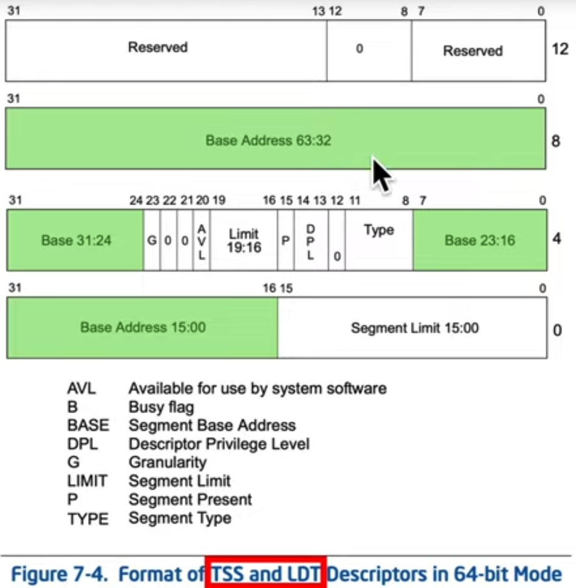

## Privilege Rings

* They are the interaction between the Requested Privilege Level (RPL), Descriptor Privilege Level (DPL), and introducing, the Current Privilege Level (CPL)

* "The CPL is defined as the protection level of the currently executing code segment."

* "Current privilege level (CPL) field – (Bits 0 and 1 of the CS segment register)."

### Enforcement

* Privilege rings are automatically enforced by the hardware on instruction fetches (i.e. code execution) and data fetches

* E.g. if attempting a control flow transition via JMP/CALL/RET from one segment into another, the hardware will check the DPL of the target segment and allow the access only if CPL <= DPL

* "Privileged Instructions" can only execute at CPL == 0 (including LGDT, LLDT)

### You Wish!

* "The MOV instruction cannot be used to load the CS register. Attempting to do so will result in an invalid opcode exception"

* Also there's no "POP CS" instruction like there is for SS, DS, ES, FS, SS

### Conclusion

* Kernel makes sure that when it allows userspace programs to run, they have a CS register with the segment selector RPL == 3, which points at segment descriptor with a DPL == 3. That way, the CPL == 3 when the code is executing in the context of that code segment

* Kernel makes sure that when control returns to it, a CS register is switched with one that has the segment selector RPL == 0, which points at segment descriptor with a DPL == 0. That way, the CPL == 0 when the code is executing in the context of that code segment

## Call Gates

* A Call Gate is a way to transfer control from one segment to another segment at a different privilege level

### Call Gate Descriptor

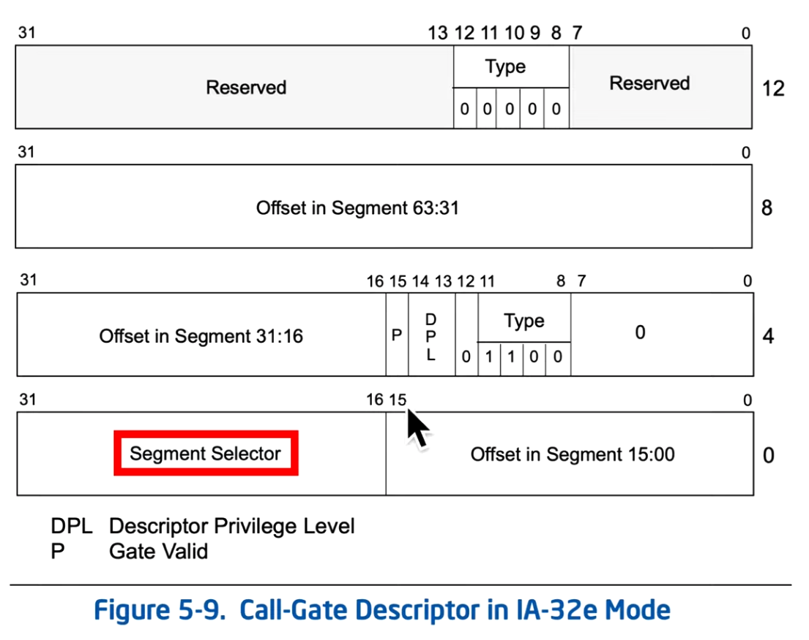

### Call the Call Gate

* To transition from CPL 3 to CPL 0, you would issue a CALL instruction with a far pointer that had a Segment Selector that pointed at a Call Gate Segment Descriptor

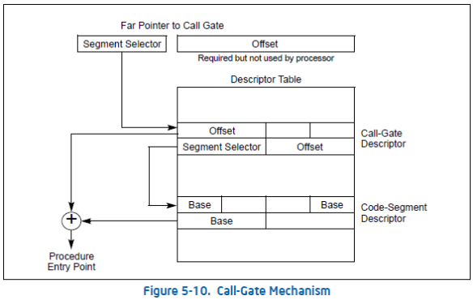

### How to Return From a Call Through a Call Gate?

* A normal CALL pushes RIP

* An inter-privilege far CALL through Call Gate pushes SS:RSP and CS:RIP

* RET can pop those back off the stack to return from an inter-privilege far call

## Implicit Use of Segment Registers

* "The segment selector can be specified either implicitly or explicitly. The most common method of specifying a segment selector is to load it in a segment register and then allow the processor to select the register implicitly, depending on the type of operation being performed. The processor automatically chooses a segment according to the rules given in Table 3-5."

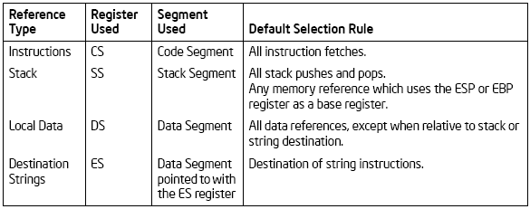

### MOVS/MOVSB/MOVSW/MOVSD/MOVSQ – Move Data from String to String

* In pure 32-bit mode or compatibility mode, (REP) MOVS is actually always implicitly referencing the DS and ES segments, even though most people don't notice

* GDB still shows DS/ES being used in 64-bit mode, which isn't technically correct according to the manual, and is probably a holdover from 32-bit mode

## Explicit Use of Segment Registers

* You can write assembly which explicitly specifies which segment register it wants to use. Just prefix the memory address with a segment register and a colon

* "mov rax, [rbx]" vs "mov rax, fs:[rbx]"

* The assembly just puts a prefix on the instruction to say "When this instruction is asking for memory, it's actually asking for memory in this segment"

* In this way you're actually specifying a full logical address / far pointer
