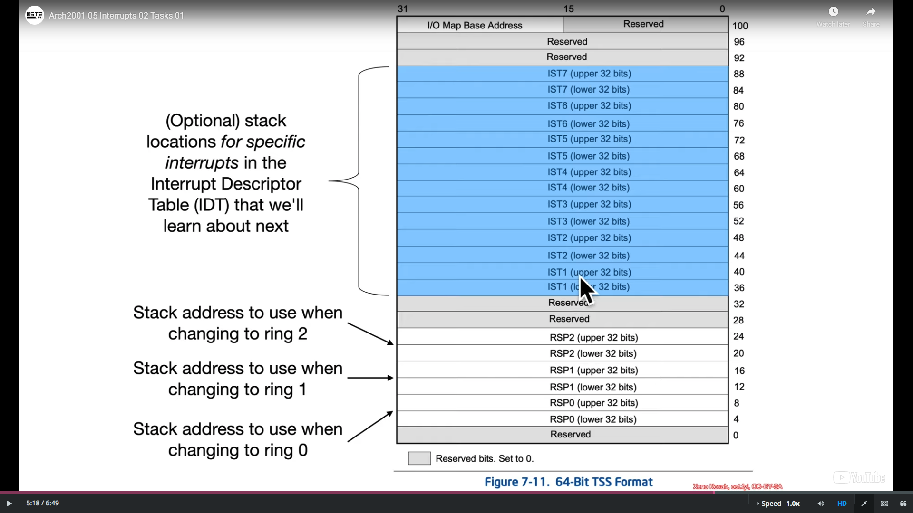

## Interrupts vs. Exceptions

* "Interrupts and exceptions are events that indicate that a condition exists somewhere in the system, the processor, or within the currently executing program or task that requires the attention of a processor."

* "When an interrupt is received or an exception is detected, the currently running procedure or task is suspended while the processor executes an interrupt or exception handler. When execution of the handler is complete, the processor resumes the execution of the interrupted procedure or task."

* "The processor receives interrupts from two sources:
  
  * External (hardware generated) interrupts
  
  * Internal (software generated) interrupts"

### Interrupts and Exceptions Terminology

* Interrupts are another way to transfer control from one segment to another at a different privilege level

* Internal interrupts are generated using instructions like INT N, INTO, UD2, etc.

* External interrupts are generated as a result of outside interference (from user, other hardware or through network)

* There are three types of exceptions:
  
  * Fault - Recoverable (RIP points at faulting instruction)
  
  * Trap - Recoverable (RIP points at instruction after trapping instruction)
  
  * Abort - Irrecoverable (RIP may or may not have been saved)

* Interrupts clear the Interrupt Flag (IF), exceptions don't

* Exceptions typically indicate error conditions, whereas interrupts usually indicate events

### Saving State

> The IRET (Interrupt Return) instruction pops the saved state back off into relevant registers, in the same sense that RET pops a saved return address into RIP

### Software Generated Interrupts

* INT N: Invoke Interrupt N
  
  * Important: While you can invoke anything in the IDT, some interrupts expect an error code. INT doesn't push any error code, and therefore a handler might behave incorrectly
  
  * INT 3: Software debug breakpoint
  
  * INT 1: Fake hardware debug breakpoint

* INTO: Invoke overflow interrupt if the Overflow Flag (OF) is set

* UD2: Invoke invalid opcode interrupt

## Tasks

* The Intel documentation often references the notion of a "task"

* It's a hardware mechanism to support multitasking by saving/restoring task state like registers

* But it wasn't getting used for that purpose, so just like with segmentation, a lot of things were removed with the x86-64 extensions

* But the Task-State Segment (TSS) is something which still must be used by the OS by virtue of being consulted on privilege changing interrupts

### Task Register (TR)

* Like 16-bit segment registers and LDTR, the 16-bit TR has a visible part, the segment selector, and a hidden part, the cached segment info which specifies the size of the Task-State Segment (TSS)

* Special instructions are used to load a value into the register or store the value out into memory
  
  * LTR – Load 16-bit segment selector into TR
  
  * STR – Store 16-bit segment selector of TR into memory

## Interrupt Descriptor Table

* An array of <= 256 16-byte descriptor entries

* 0-31 are reserved for architecture-specific exceptions and interrupts

* 32-255 are user-defined

* While it interacts with segments, you can think of it as being an array of far pointers, and when interrupt N is invoked by software or hardware, the execution transfers to the address pointed by the Nth descriptor in the table

### How is the IDT found?

* IDTR is a specific register which points at the base of the IDT

* When an interrupt or exception occurs, the hardware automatically:
  
  * looks up the IDTR
  
  * finds an appropriate offset in the IDT
  
  * pushes the saved state onto the stack (at the location determined by the TSS)
  
  * changes CS:RIP to the address of the interrupt handler, as read from the IDT entry (interrupt descriptor)

### IDTR Format

* The upper 32/64 bits of the register specify the linear address where the IDT is stored. The lower 16 bits specify the size of the table in bytes.

* Special instructions are used to load a value into the register or store it out to memory:
  
  * LIDT – Load 10 bytes from memory into IDTR
  
  * SIDT – Store 10 bytes of IDTR to memory

### The Segfault is a Lie!

* On *nix systems, when you access somewhere you're not supposed to, the program will be terminated with the reason being "Segmentation Fault"

* Looking at the table "Protected-Mode Exceptions and Interrupts", we see that there is no "Segmentation Fault" listed

* In fact, for most segmentation errors you can get, they will generate a general protection fault

* And we know that segmentation isn't used to protect memory, so, usually, if you access invalid memory you'll get a **page fault**

* The reality of the Segfault is that it's a *nix signal; SIGSEGV (signal segment violation)

* But signals are an OS level abstraction, and this "fault" isn't an x86 fault

## Interrupt Descriptors

* The descriptors in the IDT describe one of two gate types:
  
  * Interrupt Gate
  
  * Trap Gate

* "The only difference between an interrupt gate and a trap gate is the way the processor handles the IF flag in the EFLAGS register"

### IDT Relation to Segmentation

### Interrupt Gate Descriptor

* The DPL is only checked when a descriptor is accessed by a software interrupt and ignored on hardware interrupts

* IST != 0 specifies an index to use for the RSP as pulled from the TSS

## Interrupt Masking

* It's sometimes useful to disable some interrupts (e.g. to stop an interrupt from occurring in the middle of handling another interrupt). This is called "masking" the interrupt

* The Interrupt Flag (IF) in the RFLAGS register is cleared automatically whenever an interrupt occurs through an Interrupt Gate and *not* cleared if you go through a Trap Gate

* Maskable interrupts can be manually masked/unmasked by clearing/setting IF using special instructions:
  
  * CLI – Clear IF
  
  * STI – Set IF

### Interrupt Masking Exceptions

* The IF doesn't mask the explicit invokation of an interrupt using the INTN/UD2 instructions

* The IF doesn't mask a Non-Maskable Interrupt

