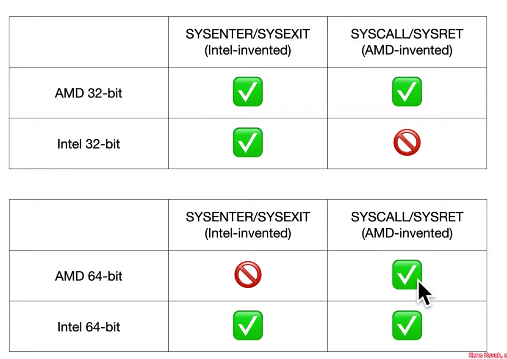

## System Calls

* The addition of privilege separation requires some way to transfer control between different execution domains

* We've already seen 2 mechanisms which can achieve this: Call Gates and Interrupts

* But those aren't current preferred methods on x86-64

### Instruction Compatibility

* SYSENTER/SYSEXIT is preferred for 32-bit

* SYSCALL/SYSRET is preferred for 64-bit

