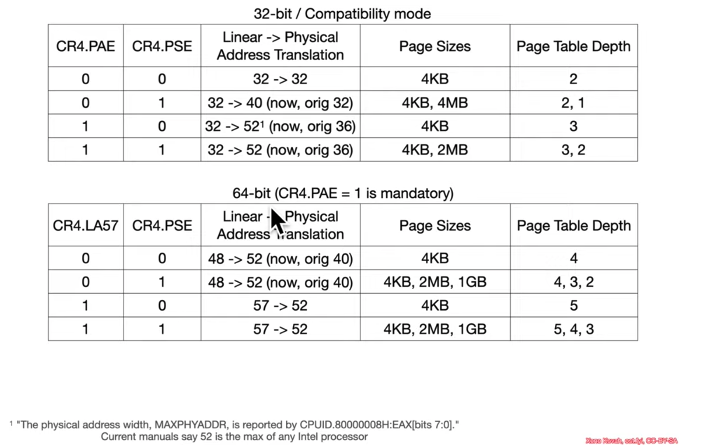
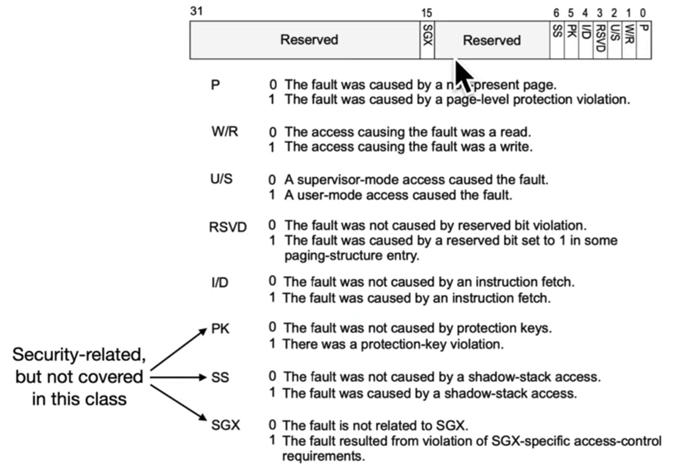

## Memory Management Unit

* MMU is a chunk of hardware in the processor which uses the current execution mode, segmentation information and paging information to perform the overall process of translating logical addresses into physical ones 

* The Translation Lookaside Buffer (TLB) is a cache of Virtual-to-Physical address mappings the MMU consults

## Virtual Memory

* A given linear memory address may not actually point to data stored in a physical RAM *right now*. It can be "swapped"/"paged out" to disk and "swapped"/"paged in" on demand when there's an attempt to access it

* This lets your OS pretend like it has more RAM than it really does at the cost of a significant performance penalty

* But the performance penalty is worth it compared to the alternative of everything breaking and grinding to a halt when all the RAM is in use

## Paging and the Control Registers

* There are 5 Control Registers (CR0-CR4) which are used for paging control as well as enabling/disabling other features

### CR0

* Protection Enabled (PE, bit 0) = Must be set in order to get into Protected Mode from the Real Mode

* Write Protect (WP, bit 16) = Stops ring 0 from writing to read-only pages
  
  * Used to facilitate "Copy-on-Write" in OSes

* Paging Enabled (PG, bit 31) = Must be set in order to enable paging. Requires PE to be set

### CR4

* Page Size Extensions (PSE, bit 4) = Allows for pages > 4KB

* Physical Address Extension (PAE, bit 5) = Allows for physical addresses > 4GB

* Page Global Enable (PGE, bit 7) = A feature to make caching page table information more efficient

* 57-bit linear addresses (LA57, bit 12) = A new and even larger memory address space is accessible

### CR3

* Points at the start of page tables, which MMU walks to translate virtual addresses into physical ones

### CR2

* If the Virtual-to-Physical lookup fails, a "page fault" (INT 14) is issued

* CR2 records the linear address which was attempted to be translated via the page table walk

### Accessing Control Registers

* `MOV CR, r64` and `MOV r64, CR`

* Only register to register moves

### Paging Permutations

## Canonical Addresses

* Even though we have a 64-bit system, current processors can't actually use a 64-bit linear address space or a 64-bit physical address space
  
  * Intel processors currently support **at most** 57-bit linear and 52-bit physical address space

* A canonical address is one in which all upper N unused bits are identical
  
  * The processor sign-extends the most significant bit of the linear address to upper N unused bits

* "A linear address is 48-bit canonical if bits 63:47 of the address are identical. Similarly, an address is 57-bit canonical if bits 63:56 of the address are identical. Any linear address that is 48-bit canonical is also 57-bit canonical."

### 48-bit Canonical Addresses

* The processor sign-extends bit 47 to yield two ranges:
  
  * Lower canonical range: 0x00000000\`00000000 - 0x00007FFF\`FFFFFFFF
  
  * Upper canonical range: 0xFFFF8000\`00000000 - 0xFFFFFFFF\`FFFFFFFF

### 57-bit Canonical Addresses

* The processor sign-extends bit 56 to yield two ranges:
  
  * Lower canonical range: 0x00000000\`00000000 - 0x00FFFFFF\`FFFFFFFF
  
  * Upper canonical range: 0xFF000000\`00000000 - 0xFFFFFFFF\`FFFFFFFF

### Cont.: Canonical Addresses

* Attempts to access non-canonical linear addresses lead to a general protection fault

* In most OSes, upper canonical range is used for kernel address space and lower canonical range - for userspace one

## Recoverable Page Faults

* Attempt to access the page that was "paged out" to disk
  
  * This will "page in" the requested page

* Stack growth crossed the page boundary
  
  * This will allocate the next page

* Attempt to write to read-only memory in Copy-on-Write mode
  
  * This will duplicate the page and commit changes there

## Page Fault Error Code

